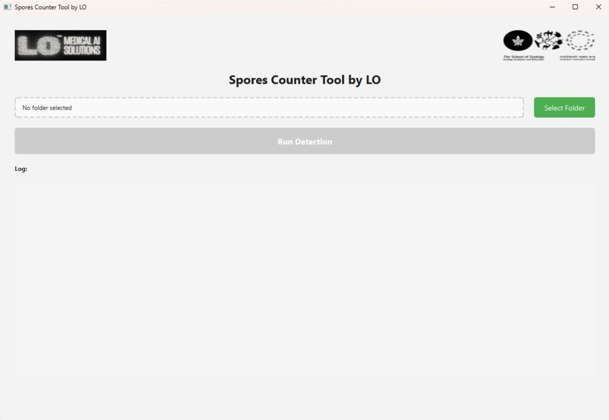
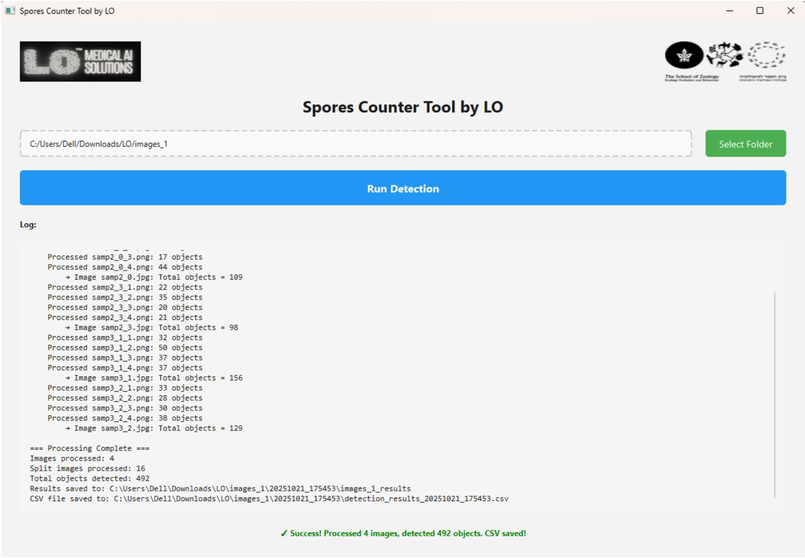
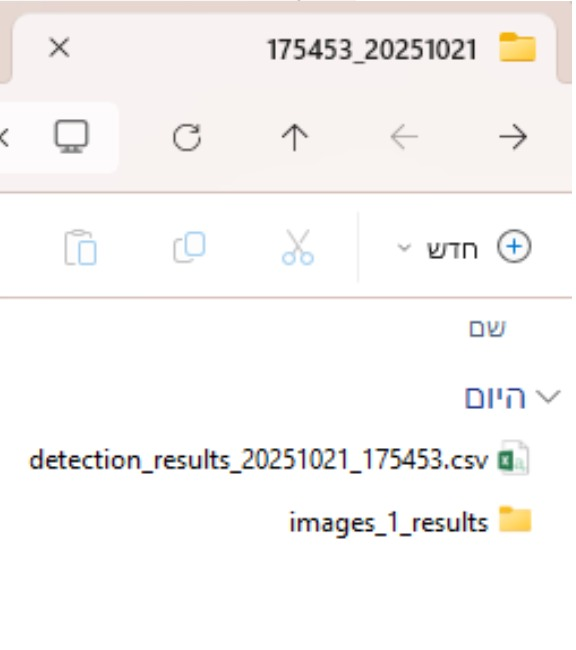

# Instructions for SporesCounterToolByLO

## Download
1. Download the file **SporesCounterToolByLO.exe** to your computer from [this link](https://drive.google.com/drive/folders/14Z0i4YiSbENjOxV0KX-GHlwQgtNFjSk4?usp=drive_link)
.  
2. Download the example images folder named **images** from [this link](https://drive.google.com/drive/folders/14Z0i4YiSbENjOxV0KX-GHlwQgtNFjSk4?usp=drive_link).

---

## Running the Tool
1. Move the file **SporesCounterToolByLO.exe** from the *Downloads* folder to a convenient location.  
2. You can create a shortcut by right-clicking → "Show more options" → "Send to" → "Desktop (create shortcut)".  
3. Double-click on **SporesCounterToolByLO.exe**.  
4. Wait – initial setup may take some time.  
5. After the setup completes, the software will open.

  

## How to Use
1. Click **SELECT FOLDER** to open a navigation window to choose the images folder.  
2. First, select the example images folder downloaded in the *Download* section. After completing the example run, you can choose any other properly organized image folder.  
3. Click **RUN DETECTION** to start the spore detection process in the background. A log of the run will appear on the screen.  
4. After the run finishes, a folder with visual results will be saved by date under the selected images folder. A CSV file with the results will also be saved.  
5. The numerical results for each image and the paths to the saved files will be displayed in the software after the run completes.

  
  

## Building the Software Locally
If **SporesCounterToolByLO.exe** does not work, follow these steps:

1. Download the folder **build_exe_kit** from [this link](https://drive.google.com/drive/folders/14Z0i4YiSbENjOxV0KX-GHlwQgtNFjSk4?usp=sharing).  
2. Extract the folder.  
3. Move it to a convenient location.  
4. Double-click **build_windows.bat** – a command window will open.  
5. Wait – rebuilding the program may take some time.  
6. When the run finishes, this message will appear:  ‘Press any key to continue . . .’ - Press **ENTER** to close the command window.  
7. If the build was successful, two new folders will appear in the same location as **build_windows.bat**: **BUILD** and **DIST**.  
8. Inside the **DIST** folder, you will find **SporesCounterToolByLO.exe**.  
9. Continue following the instructions in the *Running the Tool* section above.
